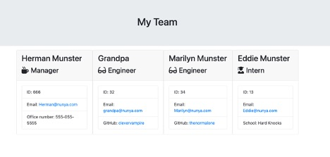

# Template Engine

## Description

This app builds a team's web page with contact information for the manager, and each engineer or intern.

## Table of Contents

\*[Installation](#installation)

\*[Usage](#usage)

\*[License](#license)

\*[Contributing](#contributing)

\*[Tests](#tests)

\*[Questions](#questions)

## Installation

To install necessary dependencies, run the following command:

1. npm install, 2. npm install express, 3. npm run test, 4. node app.js, 5. Follow the prompts to enter team member information

## Usage

_Instructions and examples of how to use:_

> node app.js

A manager could use this app to build their team's contact web page

## License

The Unlicense
This is free and unencumbered software released into the public domain. Anyone is free to copy, modify, publish, use, compile, sell, or distribute this software, either in source code form or as a compiled binary, for any purpose, commercial or non-commercial, and by any means.

## Contributing

## Tests

npm run test

## Questions

For any questions: mailto:jericfey@gmail.com

GitHub profile: https://github.com/jericfey
